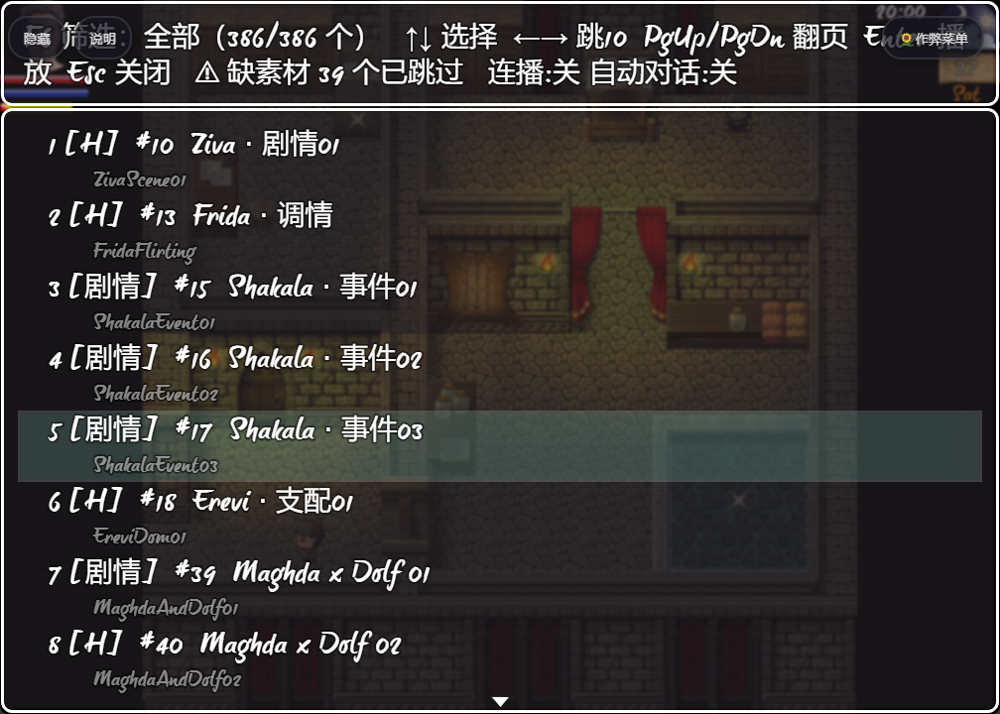
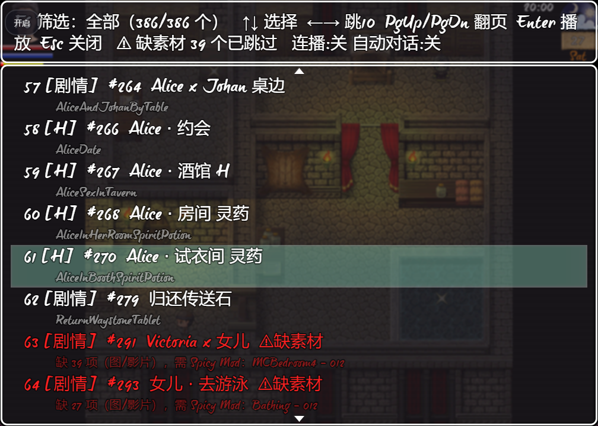

# 《农民的任务》NYD412 — 场景速播器（ScenePlayer）

给 **《农民的任务》**（Peasant's Quest，本作构建版本 **NYD412**）用的 RPG Maker MV 插件：不用再在游戏菜单里一个个点，按一个键连着看场景，或者全自动连播，并且能按类型筛选（只看 H / 只看剧情）。

**本仓库是这款游戏专用的**，不是通用插件：

- 已内置本作 **306 个场景**的清单（公共事件），全部配了中文名、并按剧情顺序排好（依据游戏自带的 215 个任务表）；
- 已内置 **类型标签**（H 270 / 剧情 36 / 杂项 0）；
- 已内置 **39 个缺素材场景**的清单（缺图片 + 缺影片）—— 这些场景依赖未安装的可选内容包（Spicy Mod），轻则 `Loading Error`，重则被 MV 的影片重试机制**卡住几十秒**，插件会标 ⚠ 并自动跳过；
- 安装步骤、FAQ 都是按本作的目录结构和插件环境写的。

场景全表见 **[SCENES.md](SCENES.md)**；按剧情顺序排好的全表见 **[STORY_ORDER.md](STORY_ORDER.md)**。

> **状态**：v2.2.0 已在游戏内实测通过 —— 缺影片场景不再卡顿，F10 不再重复对话，子场景默认不重复出现，列表默认按剧情顺序排列。

## 界面



*`F7` 列表窗（游戏内实拍）：每项两行 —— 第一行 `[类型]` + 中文名，第二行英文原名。顶部帮助栏显示当前筛选（`全部 279/306`）、排序方式（`F3 排序：剧情`）、子场景开关（`F4 子场景：隐藏（共 27 个）`）、缺素材统计与连播/自动对话状态；每项第二行还会显示它所属的剧情章节（`剧情3 与所有村民交谈`）。*



*缺素材的场景整行标红 + `⚠缺素材`，第二行写明**缺多少项、缺的是什么**（图片或影片），自动连播会直接跳过它们 —— 这正是修复「播放卡住」的那套机制。*

---

## 覆盖范围

清单来自 `tools/scan_game.py --mode auto --maps`：

**公共事件（306 个）** —— 两条口径取并集：
1. 事件名含 `Scene`（剔除 5 个真正非 CG 的：`410`/`411` 系统过场、`1894-1896` 动画机位子事件）；
2. 「像顶层场景」的：有图 + 有对白 + 不被其它事件用指令 117 调用 + `trigger=0`，且图片数 ≥4 或名字带场景感关键词。

**地图事件（80 个）** —— 指令写在 `pages[].list` 里、不在公共事件里。口径：图片 ≥5 张 + 有对白 + 触发方式为
确定/玩家接触/事件接触（排除自动执行/并行，那类可能带循环导致连播停不下来）。播放时会**先传送到该地图再触发事件**。

| 口径 | 数量 |
|---|---|
| 公共事件总数 / 含「显示图片」的 | 2040 / 1207 |
| 本清单的公共事件 | 306 |
| 含「显示图片」的地图事件 | 309（**未收录**，见下） |
| `Anim*` 动画子事件（故意不收录） | 60+ |

**类型标签**：H 270 / 剧情 36 / 杂项 0。本作是成人游戏，**绝大多数场景本身含性内容**
（实测 `ZivaScene01` 是口交、`TempleInitiationScene` 台词是「一场性快感的祭献」），
所以 **H 是默认，剧情/杂项逐条人工确认**。标签表在 `tools/tagging.py`，改完重跑 `tools/setup.py` 即可。

**仍未覆盖**：`Anim*` 子事件、以及触发方式为自动执行/并行的 6 个地图事件。

---

## 先了解本作的几个坑

这几点都是实测踩出来的，装插件前值得一看：

| 事实 | 影响 |
|---|---|
| **引擎实际是 RPG Maker MV**（`RPGMAKER_NAME === 'MV'`），尽管本作自带的 `VirtualacgPC.js` 插件头部写着 `@target MZ` —— 那是移植作者标错了 | 所以本插件是 MV 版；别拿 MZ 插件往上套 |
| 本作自带 `ListenToF8.js`，它**整体改写**了 `SceneManager.onKeyDown`：只保留 F5 重载，**F8 不再打开开发者工具** | 所以 F8 可以安全用作「播放下一个」（标准 MV 里 F8 是 devtools，会冲突） |
| 游戏目录结构是 `<游戏根目录>/www/js/plugins/`（根目录 `package.json` 的 `main` 是 `www/index.html`） | 插件要放到 `www/js/plugins/`，参数写在 `www/js/plugins.js` |
| 本作未安装可选内容包（Spicy Mod） | **39 个场景**的素材文件根本不存在，其中 23 个还缺**影片**（比缺图片严重得多，见下文） |
| 场景的对话文本已汉化，但事件名仍是英文（`SexSceneAliceTF` 之类），地图事件名更是 `EV081` 这种 | 所以本插件支持自定义中文显示名，仓库里已配好 |
| 地图事件里**既有 H 场景也有纯剧情**（`Map020#9` 是 Beth 马厩 H、`Map060#61` 是决战内尔伽勒） | 所以做了 F6 类型筛选 |

---

## 功能

| 功能 | 说明 |
|---|---|
| **F7 场景列表** | 键盘驱动的列表窗：翻页、跳转、直接播放。每项两行显示（`[类型]` + 中文名 / 英文原名） |
| **F8 单键下一个** | 不开任何菜单，按一下播下一个场景；连按就是连着看 |
| **F9 自动连播** | 当前场景一结束，自动接下一个（间隔可配） |
| **F10 自动推进对话** | 对话显示完整后自动翻页；**遇到选项/数字输入绝不替你选** |
| **F6 类型筛选** | 全部 / 仅H / 仅剧情 / 仅杂项；列表显示 `[H]`/`[剧情]`/`[杂项]`，**自动连播只在当前筛选内** |
| **F3 排序切换** | 默认**按剧情顺序**（依据游戏自带的 215 个任务表定位），按 `F3` 可切回「事件 id 顺序」 |
| **F4 子场景开关** | 有些场景内部会调用别的场景（`#1414 Hilde·帐篷3 主线` 里含 `#1415/#1416`），那些被调用的场景默认**不显示**，避免连播时内容重复；按 `F4` 可临时全部显示 |
| **缺素材检测** | 启动后读取 `img/pictures` **和 `movies`** 建索引，缺图/缺影片的场景标红 ⚠、拒绝播放、自动连播时跳过 |

设计上刻意保守：只做「触发事件」，**不直接改存档数据**；事件/对话运行中不会重入，避免叠事件。

---

## 安装

### 1. 放入插件文件

```
<游戏根目录>/www/js/plugins/ScenePlayer.js
```

### 2. 在 `www/js/plugins.js` 注册

打开 `<游戏根目录>/www/js/plugins.js`，把 **[`params/plugins-entry.txt`](params/plugins-entry.txt)** 里的那一行**整行**粘到
`var $plugins = [ ... ]` 数组的**末尾**（注意末尾逗号；若你插在最后一项之后，那一项原本没有逗号，需要自己补一个）。

粘完可以验一下语法：

```bash
node --check www/js/plugins.js
```

### 3. 重启游戏

MV 只在启动时读插件，必须重启 `Game.exe`（或按 `F5` 重载）才生效。

### 一条命令搞定（推荐）

仓库里的 `tools/setup.py` 会自动完成上面全部步骤（复制插件、扫描场景、生成参数、写入 plugins.js、修正 unlockEvents）：

```bash
# 先看会改什么
python3 tools/setup.py "/path/to/农民的任务" --dry-run

# 正式执行（自动备份、写入后回读校验、可重复执行）
python3 tools/setup.py "/path/to/农民的任务" --rebuild-unlock --yes
```

### 卸载

删掉 `www/js/plugins/ScenePlayer.js`，并删除 `www/js/plugins.js` 里 `"name":"ScenePlayer"` 那条
（或把 `"status"` 改成 `false` 临时禁用）。

---

## 使用方法

### 快捷键（在场景地图上生效）

| 按键 | 作用 |
|---|---|
| `F7` | 打开场景列表窗口 |
| `F8` | 直接播放下一个场景（连按＝连着看） |
| `F9` | 自动连播开/关 |
| `F10` | 自动推进对话开/关 |
| `F6` | 切换类型筛选：全部 → 仅H → 仅剧情 → 仅杂项 |
| `F3` | 排序切换：剧情顺序 ↔ 事件 id 顺序 |
| `F4` | 显示/隐藏子场景（被别的场景调用的场景） |

**只看 H 场景**：按 `F6` 切到「仅H」→ `F9` 开连播 → `F10` 开自动对话，就是全自动。

### 列表窗口内

| 按键 | 作用 |
|---|---|
| `↑` `↓` | 上下选择 |
| `←` `→` | 一次跳 10 个 |
| `PgUp` `PgDn` | 翻页 |
| `Home` `End` | 跳到首/尾 |
| `Enter` | 播放选中场景并关闭窗口 |
| `Esc` | 关闭窗口 |

配色：选中＝蓝，上次播放＝橙，**缺素材＝红 + `⚠缺素材`**。

### 控制台 API

游戏里按 `F12` 打开开发者工具，Console 里：

```js
ScenePlayer.playNext()          // 播放下一个
ScenePlayer.playPrev()          // 播放上一个
ScenePlayer.play(67)            // 播放当前筛选列表第 68 项（0 起）
ScenePlayer.playId(1257)        // 按公共事件 id 播放
ScenePlayer.playMap(8, 3)       // 按地图/事件 id 播放地图场景
ScenePlayer.setFilter('h')      // 切筛选：all / h / story / misc
ScenePlayer.cycleFilter()       // 循环切换
ScenePlayer.toggleAuto()        // 切换自动连播
ScenePlayer.toggleMsgAuto()     // 切换自动推进对话
ScenePlayer.status()            // 打印当前状态
ScenePlayer.checkAssets()       // 打印缺素材报告
ScenePlayer.items               // 全部场景（含 kind/id/mapId/tag）
ScenePlayer.view                // 当前筛选下的可见场景
```

---

## 缺素材检测

## 剧情顺序（默认排序）

事件 id 是作者创建事件的先后，**不等于剧情顺序** —— 早期创建的事件可能属于后期剧情。所以列表默认按剧情顺序排。

依据是**游戏自己的任务表**：`YEP_QuestJournal` + `YEP_X_MoreQuests1` 里定义了
**215 个任务**（编号 1~215），而任务编号顺序就是剧情推进顺序 —— 它和攻略里的
`任务212：是个男孩` 完全对得上。

`tools/story_order.py` 给每个场景打分选出它属于哪个任务，用的是这几路信号：

| 信号 | 例子 | 权重 |
|---|---|---|
| **子标签命中任务标题** | `Julia · 挤奶` → 任务153「挤奶女」；`Daiyu · 脱衣` → 任务183「脱衣舞俱乐部」 | 最高（10） |
| **人物名**（中英对照） | `Victoria` ↔ 任务里的「维多利亚」（`tools/quest_names.py` 的 `NAMES` 表） | 5 |
| **地点名**（中英对照） | `灰港城堡` ↔ 「男爵城堡」/「Greyport」 | 3 |
| **前置条件里的概念词** | 开关 `HildeBathing` → 概念「洗澡」；`MilkingStage` → 「挤奶」 | 按稀有度 1~6 |
| **图片文件名** | `FreyjaHall - 001` 拆词 | 1 |

> 概念词只在**和人物一起**出现在同一个任务里时才加分 —— 单看概念会到处误配
> （「哥布林」「悬赏」「怀孕」在几十个任务里都有）。

**同一个任务内**再按作者写场景的顺序排（用场景测的**人物专属变量 id**，
它基本跟着剧情走）。实测效果：

| 人物 | 排出来的顺序 |
|---|---|
| Victoria | 剧情01 → 剧情02 → 剧情03 →（变量196）裸体 →（199）怀孕 H01 →（419）内衣怀孕 |
| Hilde |（变量96）温泉 →（361）帐篷 → 沐浴 → 帐篷2 →（1307）帐篷3 后门/正常位 |
| Julia |（648）谷仓 H →（683）床上 →（988）谷仓婚礼 →（1259）狐狸 H → 任务153 挤奶 |
| Alice |（85）书库/厨房/锁链 →（256）房间灵药 → 约会 |

当前结果：**288 / 306 个场景已定位**（分布在 63 个任务里）。剩下 18 个定位不到，
排在最后，可用 `params/storyOverrides.json` 手工订正。

* **`F3`** 可切回「事件 id 顺序」；每项第二行显示所属任务（`任务153 挤奶女`）。
* 逐条的定位依据列在 **[STORY_ORDER.md](STORY_ORDER.md)**。
* 手工订正：`params/storyOverrides.json`（`{"场景键": 任务号}`，`null` = 放最后），
  改完跑 `python3 tools/setup.py "/path/to/农民的任务" --yes`。优先级最高。

> **局限（说清楚）**：任务元数据里**没有**区分同一人物的多个 H 场景属于哪个任务的信息。
> 所以像 `Victoria · 剧情01~03`、`Cathrine · 卧室3~5` 这类同人物的场景会落在**同一个任务**里，
> 靠变量 id 排先后。要把某个场景挪到别处，用上面的 `storyOverrides.json`。

## 子场景（嵌套）默认不显示

本作有不少场景**内部又调用了别的场景**。例如 `#1414 Hilde · 帐篷3 主线` 里会调用
`#1415 Hilde · 帐篷3 后门` 和 `#1416 Hilde · 帐篷3 正常位`；`#264 Alice × Johan 桌边` 里含 `#297 女儿 · 床上2`。

这些被调用的场景如果也单独占列表一项，连播时就会**先播大场景、再把这个小场景单独播一遍**，看起来像重复。
`tools/nesting.py` 沿「调用公共事件(117)」把这种关系全查出来：

| | 数量 |
|---|---|
| 公共事件场景 | 306 |
| 其中**被别的场景调用**（子场景） | **81**（H 77 / 剧情 4） |
| **列表默认显示** | **305** |

* **默认**：子场景不出现在列表里，连播也跳过它们（`SP.view` 直接排除）。
* **`F4`**：临时显示/隐藏。显示时这些行会带 `⊂子场景` 标记，第二行写明「⊂ 被『XX』调用」，方便判断该不该单独看。
* **环保护**：`#1260 Caleah · 酿酒 H` 与 `#1261 Alice · 酿酒 H` 互相调用且**没有环外入口**，
  全隐藏就没法播了，所以保留 `#1260` 可见（生成时会打印这条保护信息）。
* 多层嵌套（A→B→C）按同一规则处理：`C` 被 `B` 调用就隐藏，不论 `B` 自己是否隐藏。

重新生成（游戏更新后）：

```bash
python3 tools/nesting.py "/path/to/农民的任务"            # 看报告
python3 tools/setup.py  "/path/to/农民的任务" --yes       # 一键重扫并写入 subScenes
```


本作未安装可选内容包（Spicy Mod），**306 个场景里有 30 个**的素材文件不存在
（缺图 1298 张 + 缺影片 152 个），触发即：

```
Loading Error
Failed to load: img/pictures/DaughterBedScene - 001.png
Missing Spicy Mod detected: ...
```

插件对此的处理：

1. 首次需要时读取 `img/pictures` 和 `movies` 建索引（**不是开机时**，不拖慢启动）；
2. 图片目录用一张必然存在的通用图（`BlackImage`）自检是否找对，`www/` 与裸目录两种布局都试；找不到就退回 `params/missingAssets.json` 的离线清单；
3. 只拦**确实缺失**的：列表标 ⚠、手动播放被拒并提示、自动连播自动跳过；
4. 全部不可播时自动连播停下并提示，不会每帧重试刷屏；
5. **以后装上 Spicy Mod 会自动放行**（重启游戏后生效，索引在启动时建立）。

### 为什么影片缺失比图片更严重

图片缺失只是 `Loading Error`（有提示）。**影片缺失会被 MV 反复重试加载**：

```js
Graphics._playVideo:  this._video.onerror = this._videoLoader;   // 出错 → 重试加载器
                      this._videoLoading = true;                 // isVideoPlaying() = true → 解释器卡在 waitMode 'video'
ResourceHandler._defaultRetryInterval = [500, 1000, 3000];       // 每个缺失影片卡约 4.5 秒
```

本作 923 个影片引用里有 **100 个文件不存在**，而 `Beth · 求欢1` 一个场景就缺 12 个影片
（≈54 秒卡顿）。**表现就是「播放时莫名卡住、点一下才动」**。所以缺素材检测必须同时查 `movies/`。

39 个受影响场景见 [SCENES.md](SCENES.md) 里标 ⚠ 的行，或跑 `ScenePlayer.checkAssets()`。

---

## 参数说明

| 参数 | 本作取值 | 说明 |
|---|---|---|
| `sceneList` | 306 项 | 公共事件场景 `[id, 中文名, 英文原名]` |
| `mapScenes` | `[]` | 地图事件场景，当前**留空**（见下方「为什么列表里没有地图事件」） |
| `tags` | 306 条 | 类型标签 `{"键":"h\|story\|misc"}`，键为公共事件 id |
| `missingAssets` | 39 个场景 | 缺素材清单，影片项带 `movie:` 前缀 |
| `openKey` | `118`（F7） | 打开列表 |
| `nextKey` | `119`（F8） | 播放下一个 |
| `autoKey` | `120`（F9） | 自动连播开关 |
| `msgKey` | `121`（F10） | 自动推进对话开关 |
| `filterKey` | `117`（F6） | 类型筛选开关 |
| `sortKey` | `114`（F3） | 排序切换开关 |
| `storyOrder` | 自动生成 | 剧情顺序表 `[[场景键,任务号],...]`，由 `tools/story_order.py` 生成 |
| `storyChapters` | 自动生成 | 215 个任务标题（按任务号索引） |
| `subKey` | `115`（F4） | 显示/隐藏子场景开关 |
| `subScenes` | 自动生成 | 子场景清单 `{"被调用场景键":[调用者键,...]}`，由 `tools/nesting.py` 生成 |
| `autoDelay` | `60` | 场景结束后等多少帧播下一个（60 帧 ≈ 1 秒） |
| `msgDelay` | `45` | 对话显示完后等多少帧翻页（45 帧 ≈ 0.75 秒） |

常用 keyCode：F3=114、F4=115、F6=117、F7=118、F8=119、F9=120、F10=121、F11=122。

> 若按 `F7` 出现怪异光标（Chromium 的「插入符浏览」抢键），把 `openKey` 改成 `"122"`（F11）。
> 注意别用 `116`（F5，本作 `ListenToF8.js` 绑成了重载）、`123`（F12，开发者工具）、`117`（F6，已被本插件用作类型筛选）。

---

## 为什么列表里没有地图事件

本作还有 **80 个「地图事件」**（指令写在 `pages[].list` 里，不在公共事件里）也像场景
—— 每个都有 24~64 张图片、几十到三百多行对白，比如 `Map060#61` 是**决战内尔伽勒**、
`Map020#9` 是 Beth 马厩 H、`m8:3` 魔法之井事件有 64 张图 315 行对白。
**它们不是传送触发器**，是实打实的场景。

但当前版本**没有收录它们**，原因：

* 播放地图事件只能靠「先传送到那张地图、再 `event.start()`」，也就是**会真的把玩家传送走**，
  且落地位置是事件所在坐标 —— 连播时表现为「画面在地图之间跳」；
* 地图事件更容易改开关/变量，风险比公共事件高。

所以默认清单只含 306 个公共事件场景。**代码和参数都还在**，想恢复：

```bash
python3 tools/setup.py "/path/to/农民的任务" --yes      # 去掉 --no-maps 即恢复 80 个地图场景
```

恢复后列表会变成 386 项（含 🗺 标记），`F6` 的「杂项」分类也会有内容
（当前的 306 个场景里没有杂项，那 6 个杂项都是地图事件）。

> 播放地图场景的实现（`reserveTransfer` → 等落地 → `event.start()`）仍然保留，
> 相关冒烟测试在地图场景为空时会自动跳过。

## 仓库内容

```
ScenePlayer.js               插件本体（v2.0.0）
SCENES.md                    306 个场景对照表（类型/id/中文名/原名/指令数/首句/缺素材/是否在 unlockEvents/是否子场景）
docs/screenshot-*.png        界面截图（游戏内实拍）
README.md
CHANGELOG.md
params/sceneList.json        306 项公共事件场景
params/mapScenes.json        地图事件场景（当前为空数组）
params/tags.json             306 条类型标签
params/missingAssets.json    39 个缺素材场景的缺失文件名（图片 + movie: 影片）
params/names.zh.json         中文名映射
params/plugins-entry.txt     可直接粘进 www/js/plugins.js 的整行条目
tools/setup.py               一键安装/更新（扫描 → 写参数 → 修 unlockEvents）
tools/scan_game.py           扫描游戏生成参数（--mode scene|auto|all-pics，--maps）
tools/tagging.py             类型标签的人工确认表（改标签改这里）
tools/smoke_test.js          无头冒烟测试（105 项断言，不需要启动游戏）
tools/nesting.py             检测嵌套场景（被别的场景调用的），生成 subScenes 参数
tools/story_order.py         按游戏自带任务表给场景定剧情顺序，生成 storyOrder 参数
tools/quest_names.py         中英人名/地点/概念对照表（改匹配规则改这里）
tools/make_scenes_md.py      重新生成 SCENES.md
STORY_ORDER.md               306 个场景的剧情顺序全表（含每个场景的定位依据）
tools/fix-unlock-events.py   只修 unlockEvents（剔除缺素材 id / 装包后恢复）
```

## 重新生成清单（游戏更新到 NYD413+ 时）

```bash
# 一条命令：扫描 → 生成参数 → 写入 plugins.js → 修正 unlockEvents
python3 tools/setup.py "/path/to/农民的任务" --rebuild-unlock --yes

# 只想拿到参数文本：
python3 tools/scan_game.py "/path/to/农民的任务/www" --mode auto --maps \
    --names params/names.zh.json --exclude 410,411,1894,1895,1896 \
    --emit entry > params/plugins-entry.txt
```

脚本沿「调用公共事件」（指令 117）**递归**收集图片与影片，因此被场景调用的子事件缺图/缺影片也能算出来。
`--exclude` 里的 5 个是本作真正非 CG 的（系统过场 + 精灵动画机位子事件）。

> 新版本新增的场景不会有中文名（会回退显示英文原名），需要在 `params/names.zh.json` 里补，或直接改 `tools/tagging.py` 之外的显示名。

## 常见问题

**Q：按 F7/F8 没反应，或者按 F8 弹出了开发者工具？**
本作因为 `ListenToF8.js` 改过 `SceneManager.onKeyDown`，F8 是空的，正常可用。若你装了别的改键插件导致冲突，
把对应参数改成别的 keyCode（见上表）。

**Q：播放时莫名卡住、点一下才动？**
这就是**缺失影片**的症状（MV 每个缺失影片重试 3 次 ≈ 4.5 秒）。v2.0.0 起已把影片纳入检测，这些场景会被跳过（**已在游戏内验证不再卡顿**）。
如果还卡在某个场景上，按 `F12` 看 Console 里有没有 `[ScenePlayer] 素材索引` 日志确认索引是否建立成功，
并跑 `ScenePlayer.checkAssets()` 看报告。

**Q：报 `Loading Error: Failed to load: img/pictures/...`？**
同上，素材缺失。重新跑 `tools/setup.py` 更新 `missingAssets` 即可。

**Q：报 `TypeError: Cannot read property 'length' of undefined` at `maxItems`？**
v1.0.0 的 bug（`Window_Selectable.initialize` 内部会先调 `maxItems()`，而当时 `_data` 还没初始化），
v1.0.1 已修，请用最新版。

**Q：按 F10 后同一段对话反复播？**
v2.0.0/v2.0.1 的 bug：自动翻页时只清了 `Window_Message.pause`，没像 MV 的按键分支那样跟着调
`terminateMessage()`，导致 `$gameMessage` 没被清掉、下一帧又从头 `startMessage()`。
v2.0.2 已修（`SP.advanceMessage()`）。

**Q：报 `Cannot read property 'list' of undefined` at `Game_Event.list`？**
v2.0.0 的 bug：地图事件**当前没有生效的事件页**（页条件未满足，`_pageIndex = -1`）时，
`Game_Event.list()` 里的 `this.page().list` 会抛错。v2.0.1 已修（改用 `SP.pageListOf()` 安全取值，
这种场景会提示「当前没有生效的事件页，跳过」）。

**Q：作弊菜单里选到缺素材的场景照样报错？**
对，`VirtualacgPC` 的 `unlockEvents` 里也含这些 id，那个菜单不走本插件的素材检查。
用 `tools/fix-unlock-events.py` 收窄到 276 个（`306 - 30`）：

```bash
python3 tools/fix-unlock-events.py "/path/to/农民的任务/www" --dry-run
python3 tools/fix-unlock-events.py "/path/to/农民的任务/www"
python3 tools/fix-unlock-events.py "/path/to/农民的任务/www" --restore   # 装了 Spicy Mod 后加回来
```

**Q：自动连播到某个场景停了？**
① 该场景缺素材被跳过、且后面没有可播的了 → 会提示「自动连播已停止」；
② 场景里有需要你操作的**选项** —— `F10` 的自动推进**不会替你选选项**，这是刻意设计。

**Q：地图场景播放后我人在别的地图上了？**
这是设计行为（地图事件的指令必须在该地图上跑）。播放完就地留下，按 `F7` 继续选就行。

**Q：会污染存档吗？**
插件本身不写存档。但**被触发的场景本身会改开关/变量/物品**，按顺序乱播 386 个场景可能把进度搞乱。
**建议先存一个独立存档再玩自动连播。**

## 开发与测试

插件是单文件、无构建步骤。核心逻辑（列表解析、筛选、缺素材判定、连播推进、剧情排序、地图场景传送/触发、按键路由）
都是 `ScenePlayer.*` 上的纯方法，可以在 Node 里用最小 MV 运行时桩做无头测试，不必启动游戏：

```bash
node tools/smoke_test.js                      # 默认测本作路径
node tools/smoke_test.js /path/to/game        # 指定游戏根目录
```

当前 **100 项断言**（收录地图事件时为 122 项），覆盖筛选、剧情排序、地图场景传送/超时/防重复触发、影片索引、跳过缺素材、两行绘制等。
注意它加载的是**游戏里实际安装的那份** `ScenePlayer.js`（不是仓库副本），所以验证的是真正跑起来的代码。

写测试桩时**务必忠实复刻** `Window_Selectable.prototype.initialize` 那条调用链：
`initialize → deactivate → reselect → select → ensureCursorVisible → maxTopRow → maxRows → maxItems`。
v1.0.0 那个崩溃就是因为测试桩简化了这条链而漏掉的。

## 更新日志

见 [CHANGELOG.md](CHANGELOG.md)。

## License

[MIT](LICENSE)。本仓库只含插件代码与场景清单（id/名称/标签），**不含任何游戏资源**。
